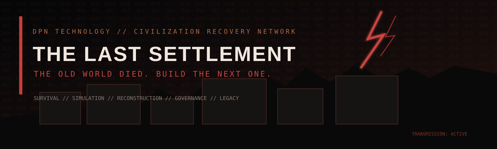

<p align="center">
  
</p>

<p align="center">
  <strong>DPN TECHNOLOGY // CIVILIZATION RECOVERY NETWORK</strong><br>
  <em>The old world died. Build the next one.</em>
</p>

<p align="center">
  
  
  
  
</p>

<p align="center">
  <a href="https://github.com/DPN-Technology/The-Last-Settlement/actions/workflows/validate.yml"></a>
  <a href="https://github.com/DPN-Technology/The-Last-Settlement/actions/workflows/codeql.yml"></a>
  <a href="https://github.com/DPN-Technology/The-Last-Settlement/actions/workflows/supply-chain.yml"></a>
</p>

---

```text
[DPN CIVILIZATION RECOVERY NETWORK]

> Establishing emergency uplink..................... CONNECTED
> Locating active population centers................ NETWORK CAPABLE
> Verifying command authority....................... ACCEPTED
> Settlement designation............................ LAST HAVEN // SITE-01
> Recovery network status........................... EXPANDING
> Recovery directive................................. ACTIVE

THE LAST SETTLEMENT IS ONLINE.
```

# THE LAST SETTLEMENT

**The Last Settlement** is an original PC survival, colony, and civilization simulation developed under **DPN Technology**.

You do not simply place buildings and watch numbers rise.

You are responsible for the last known organized human settlement after the collapse of the old world. Every survivor is an individual. Every shortage has consequences. Every system can fail. Every decision becomes part of the settlement's history.

The game begins with a handful of survivors and almost nothing else.

The long-term goal is to rebuild **civilization itself**.

> **Survive the night. Stabilize the settlement. Rebuild the world.**

---

## CURRENT TRANSMISSION // BUILD 1.0.5

The current foundation is already moving beyond a static colony prototype.

### STABLE WINDOWS RELEASE // v1.0.5

The first stable Windows release is live on GitHub.

- Release: **The Last Settlement v1.0.5**
- Stable tag: `v1.0.5`
- Stable release source: `fd1e5cd403ac7d1d9325f2057dd9b7b15afa4e86`
- Windows MSI installer published
- Windows x86_64 portable ZIP published
- Combined SHA-256 manifest published
- Machine-readable `windows-release.json` published
- In-game Update Command now has a live `/releases/latest` target
- Release was promoted only after Windows Build, CI Gate, CodeQL, Supply Chain and Code Quality were all green on the release source

### LIVE NOW

- Overhead settlement simulation
- Clickable survivors
- Clickable infrastructure
- Full survivor inspection panel
- Individual names, ages, jobs, traits, health, morale, loyalty and stress
- Hunger, thirst and fatigue
- Needs-driven behavior
- Eating, drinking and sleeping
- Day/night work schedules
- Job-specific work states
- Farming production
- Engineering and power support
- Construction/material output
- Medical recovery support
- Scavenging output
- Pocket inventory foundation
- Survivor skill matrix
- Dynamic event feed
- Settlement resources
- Building condition and capacity
- Pause and multi-speed simulation
- Camera pan and zoom
- DPN reconstruction-command HUD

### SETTLEMENT OPERATIONS // LIVE

- Physical stockpiles by settlement zone
- Item movement through hauler work
- Work-order queue
- Survivor-specific work priorities
- Day / night shift assignment
- Skill-based production efficiency
- Injury states
- Medical treatment progress
- Meals as a separate consumable
- Save/load to JSON
- Incidents that now damage or add to real stockpiles

### CONSTRUCTION SYSTEM // LIVE

- Toggleable build mode
- Grid-snapped blueprint placement
- Wall construction
- Floor construction
- Door construction
- Rotatable walls and doors
- Shelter modules
- Storage modules
- Construction material costs
- Builder assignment to active blueprints
- Construction-skill-based build speed
- Visible blueprint completion progress
- Demolition and salvage recovery
- Repair work orders
- Basic enclosed-room detection
- Wall-aware survivor movement
- Construction state saved and restored

### UTILITIES SYSTEM // LIVE

- Generator production versus settlement demand
- Battery charge, discharge and reserve capacity
- Power consumers across command, housing, industry, medical and utilities
- Water extraction pumps
- Raw-water reserve
- Water purification
- Clean-water production rate
- Water storage
- Sewage generation from population
- Sewage processing capacity
- Sanitation rating
- Grid trips and pump failures
- Engineer-driven service recovery
- Utility consequences that affect thirst, stress, morale and health
- Utility build catalog: generators, batteries, poles, pumps, purifiers, tanks, pipes and sewage processors
- Power, water and sewage overlays
- Infrastructure status in the building inspector
- Utility state persisted in save version 3

### RELATIONSHIPS + FAMILIES // LIVE

- Persistent relationship scores between survivors
- Personality-driven compatibility
- Positive and negative social interactions
- Social need pressure
- Morale/stress consequences from interactions
- Persistent memory records
- Arguments and meaningful-conversation memories
- Partner formation
- Relationship breakups
- Family names
- Biological sex state for family simulation
- Pregnancy and birth
- Parent/child relationship links
- Children as persistent settlement citizens
- Aging and birthdays
- Coming-of-age transition into the workforce
- Social/family data persisted in save version 4
- Survivor inspector now shows partner, children, memory count and latest memory

### WORLD + EXPEDITIONS // LIVE

- Regional world map
- Fog-of-war discovery
- Settlement-centered radio range
- Discoverable ruins, relay sites and unknown signals
- Expedition team formation from available adult specialists
- Expedition food, water and medical loadouts
- Outbound travel time
- Search/scavenge phase
- Return travel
- Radio-contact state
- Location danger ratings
- Security-skill risk reduction
- Expedition injuries
- Expedition deaths
- Salvage cargo
- Resource returns into real settlement stockpiles
- Depleted locations
- Radio relay restoration and extended range
- Active expedition tracking
- World/expedition state persisted in save version 5
- Expedition members removed from home occupancy/social simulation while away

### GOVERNMENT + SOCIETY // LIVE

- Interim civic council and settlement leader
- Recurring elections
- Council membership
- Government legitimacy
- Settlement unrest
- Crime pressure driven by scarcity, stress and security staffing
- Political blocs / factions
- Citizen political values: liberty, order and welfare
- Law register
- Rationing policy
- Security policy
- Labor policy
- Justice policy
- Speech policy
- Citizen loyalty reactions to laws
- Theft, assault and sabotage cases
- Guard-driven investigations
- Court resolution
- Restorative, balanced and punitive justice outcomes
- Incarceration and sentence completion
- Protests at high unrest
- Governance crisis escalation
- Civic Command panel
- Government state persisted in save version 6

### INDUSTRY + ECONOMY // LIVE

- Manufacturing recipes
- Workshop production queue
- Skill-weighted production speed
- Machine parts
- Components
- Tool kits
- Fuel blending
- Industrial stock
- Settlement credits
- Scarcity-driven market prices
- Buying and selling
- Trade log
- Vehicle condition and fuel foundation
- Industry/economy command panel
- Economy state persisted in save version 7

### INDUSTRIAL LOGISTICS // LIVE

- Multiple production lines based on workshop count
- Warehouse capacity from storage modules
- Warehouse overflow pressure
- Industrial material loss under severe storage pressure
- Production efficiency penalties from storage congestion
- Tool-kit production bonuses
- Generator fuel consumption
- Vehicle fuel consumption
- Vehicle-assisted hauling bonus
- Automatic vehicle refueling from industrial fuel stock
- Vehicle repair kits
- Player-triggered vehicle repair
- Production bottleneck reporting
- Trade activity influencing future market prices
- Industrial logistics persisted in save version 8

### REGIONAL TRADE // LIVE

- Discoverable trade-hub settlements
- Cedar Union regional market
- Riverbend Collective regional market
- Faction-specific market inventories
- Faction-specific price modifiers
- Reputation discounts
- Inbound trade caravans
- Route-risk / caravan loss
- 36-hour trading windows
- Caravan return routes
- Regional market stock persistence
- World-map caravan visualization
- Industry Command market-source switching
- Regional buy/sell transactions
- Regional trade history
- Player-created production orders
- Utility-truck manufacturing
- Regional trade state persisted in save version 9

### FACTIONS + CONFLICT // LIVE

- Regional AI faction settlements
- Cedar Union, Riverbend Collective, Iron Pact and Lantern Medics
- Faction reputation
- Neutral / friendly / allied / hostile dispositions
- Faction strength, wealth and intelligence
- Diplomacy command interface
- Aid shipments that improve relations
- Trade agreements
- Trade-agreement caravan discounts
- Truce offers
- Hostile espionage
- Infrastructure sabotage
- Raid warnings with ETA
- Raid attack strength
- Settlement defense score
- Guards contributing security skill
- Walls and command infrastructure contributing defense
- Raid victories and breaches
- Resource theft after breaches
- Building damage
- Guard injuries
- Morale and government-unrest consequences
- Friendly/allied support events
- Conflict history
- Faction state persisted in save version 10
- Radio relay progression fixed so restoration permanently extends range

### CIVILIZATION NETWORK // LIVE

- Civilization-wide recovery layer
- Player-founded secondary settlements
- Four-survivor founding teams drawn from the live Last Haven population
- Colonists retain their actual survivor identities
- Secondary-settlement specialization based on founding site
- Agriculture, medical, industrial, logistics and general colonies
- Independent colony food, water, medicine, materials, fuel and parts stores
- Secondary-settlement morale, infrastructure and security
- Automatic permanent logistics routes
- Daily bidirectional regional surplus transfers using real settlement stockpiles
- Civilization recovery score
- Civilization stability score
- Recovery phases: Survive → Stabilize → Expand → Regional Power → Rebuild Civilization
- Civilization milestones
- Historical archive
- Critical incidents automatically written into civilization history
- Multi-settlement world-map nodes
- Civilization Command interface
- Civilization state persisted in save version 14
- Founding sites created from secured and cleared ruins

### SYSTEM STATUS // BUILD 1.0.5

| Layer | Status | Live Integration |
|---|---|---|
| Survivor AI + Needs | **ONLINE** | Hunger, thirst, fatigue, work, injuries, treatment |
| Construction | **ONLINE** | Blueprints, builders, materials, repairs, demolition |
| Utilities | **ONLINE** | Power, fuel, water, purification, sewage, sanitation |
| Relationships | **ONLINE** | Memories, partners, families, births, aging |
| World / Expeditions | **ONLINE** | Fog of war, ruins, risk, casualties, salvage |
| Government | **ONLINE** | Laws, elections, crime, courts, legitimacy, unrest |
| Industry / Economy | **ONLINE** | Production, warehouses, vehicles, markets, caravans |
| Factions / Conflict | **ONLINE** | Reputation, diplomacy, espionage, raids, defense |
| Civilization Network | **ONLINE — EXPANDING** | Multiple settlements, routes, archive, recovery score |
| Large-Scale Optimization | **IN DEVELOPMENT** | Performance profiling and population scaling |

### CIVILIZATION OPERATIONS // LIVE

- Colony status states: Stable, Recovering, Degraded and Emergency
- Colony emergencies: food shortage, water crisis, infrastructure failure, security incident, storm damage, disease cluster and equipment failure
- Emergency aid packages using real Last Haven food, water and medicine
- Player-controlled colony specialization changes
- Colony specialization refocus costs real materials and machine parts
- Civilization-wide autonomy policy
- Civilization-wide freight policy
- Civilization-wide security policy
- Configurable freight-route on/off state
- Freight route priority levels
- Freight cargo focus: Balanced, Survival or Industrial
- Policy-driven colony production and security growth
- Policy-driven regional freight throughput
- Save schema version 12 persistence for policies and emergencies
- Backward normalization for older civilization saves

### COLONY DEVELOPMENT + RECOVERY PROJECTS // LIVE

- Permanent colony module construction
- Housing Blocks
- Farm Complexes
- Clinic Modules
- Workshop Bays
- Defense Perimeters
- Freight Depots
- Radio Towers
- Colony-local construction costs using delivered materials, parts and medicine
- Colonist construction/engineering skill driving project speed
- Module counts visible in Civilization Command
- Farm modules increase colony food production
- Clinic modules increase medicine production and can contain disease outbreaks
- Workshop modules produce materials and machine parts
- Defense modules strengthen colony security
- Freight Depots increase route throughput
- Radio Towers improve colony morale/security
- Four civilization-scale recovery megaprojects
- Regional Power Grid
- Clean Water Network
- Medical Corridor
- Communications Backbone
- Incremental funding from real Last Haven stockpiles
- Recovery-project completion bonuses
- Completed recovery projects increase civilization recovery score
- True **CIVILIZATION RESTORED** state requires all recovery projects, 3+ settlements, 90+ recovery and 75+ stability
- Save schema version 13 persistence for colony and recovery projects

### FOUNDING TEAMS + FEDERAL GOVERNANCE // LIVE

- Manual four-survivor founding roster
- Eligible colonist cycling and roster toggle controls
- Manual founding roster persisted in saves
- Automatic founding selection remains available when no manual roster is set
- Survivor migration from Last Haven into established colonies
- Colony housing capacity based on Housing Block modules
- Migration blocked when a colony is full
- Offsite survivors removed from Last Haven-local morale calculations
- Settlement representatives selected from real resident survivors
- Federal representation charter
- Federal contribution/tithe charter
- Federal rights charter
- Federal legitimacy
- Recovery-network cohesion
- Federal reserve / treasury
- Weekly federal council sessions
- Council accord, session and deadlock outcomes
- Federal disputes when cohesion collapses
- Colony morale reactions to charter changes
- Federal legitimacy and cohesion now feed directly into civilization stability
- Federal emergency reserve support for colony crises
- Save schema version 14 persistence for federal governance + founding roster

### RELEASE + UPDATE CHANNEL // LIVE

- Versioned Windows distribution pipeline
- Development builds from `main`
- Prerelease channel from hyphenated `v*` tags
- Stable release channel from clean `vX.Y.Z` tags
- Machine-readable `windows-release.json`
- Release schema version 1
- Portable ZIP SHA-256 and size metadata
- MSI SHA-256 and size metadata
- Save-schema compatibility metadata
- Signing-state metadata
- Release asset URLs on tagged builds
- CI self-test for update-manifest hashes
- Tag-only GitHub Release publishing
- Job-scoped release write permission
- Existing tagged releases updated with asset replacement instead of duplicated
- Portable ZIP + MSI + combined checksums + update manifest published together
- Full update-channel contract documented in `docs/UPDATE_CHANNEL.md`

### SECURE UPDATE COMMAND // LIVE

- Automatic stable-release check on Windows startup
- Dedicated **DPN Update Command** panel
- **F10** opens/closes Update Command and retries release checks
- **F11** downloads the approved MSI only when a newer release is available
- **F12** saves the settlement and explicitly approves installer handoff
- Release manifest schema validation
- Product and Windows-platform validation
- Newer-version requirement / downgrade rejection
- Save-schema downgrade protection
- Authorized DPN GitHub release-origin policy
- HTTPS-only update endpoints
- Installer size metadata validation
- SHA-256 verification after download
- SHA-256 re-verification immediately before installer launch
- Staged downloads under the game's user data directory
- Failed or hash-mismatched installers are removed
- No `OS.execute` / process-spawning updater path
- User-approved Windows shell handoff only
- Unsigned release state is displayed in Update Command
- Updater security markers enforced by the repository security audit
- Godot parser gate validates the updater as part of every green build

### ACTIVE DEVELOPMENT

- Founding-team role requirements and expedition-style loadouts
- Founding-team selection UI
- Civilization-wide government
- Full faction population/economy simulation
- Offensive player operations
- Formal war declarations and peace treaties
- Defensive emplacements and automated defenses
- Expanded endgame branches and post-restoration play
- Performance profiling for large populations

---

# THE CORE PROMISE

Most management games treat disasters as isolated modifiers.

**The Last Settlement is being built around cascading consequences.**

```text
GENERATOR FAILURE
      │
      ▼
POWER LOSS
      │
      ├──────────────► WATER PUMPS STOP
      │                        │
      │                        ▼
      │                 CLEAN WATER FALLS
      │                        │
      │                        ▼
      │                  HYGIENE DECLINES
      │                        │
      │                        ▼
      │                 DISEASE INCREASES
      │
      └──────────────► FOOD STORAGE FAILS
                               │
                               ▼
                         FOOD SPOILS
                               │
                               ▼
                         RATIONING BEGINS
                               │
                               ▼
                     MORALE / LOYALTY FALL
                               │
                               ▼
                      THEFT / UNREST RISES
                               │
                               ▼
                      GOVERNMENT PRESSURE
```

No major system should exist in isolation.

That rule drives the entire architecture.

---

# SURVIVORS ARE PEOPLE, NOT WORKER ICONS

Every survivor is intended to become a persistent simulated person with their own history.

Current survivor data already includes:

```text
SURVIVOR // #007
────────────────────────────────────────
NAME            Mara Kane
AGE             31
ROLE            Medic
TRAIT           Protective
CURRENT ACTION  Work: Medical

HEALTH          91%
MORALE          74%
LOYALTY         83%
HUNGER          22%
THIRST          18%
REST            68%
STRESS          29%

SKILLS
Medicine        78
Engineering     22
Farming         31
Construction    26
Security        17
```

The current social layer already tracks memories, relationships, partnerships, families, children, aging, political values, faction affiliation and criminal history foundations.

The remaining depth will push further into trauma, fears, personal goals, rivalries, leadership ambitions, education and multi-generation legacy.

The design target remains simple:

> The player should remember **people**, not just statistics.

---

# FROM CAMP TO CIVILIZATION

```text
5–30 PEOPLE
SURVIVOR CAMP
     │
     ▼
30–150 PEOPLE
SETTLEMENT
     │
     ▼
150–500 PEOPLE
TOWN
     │
     ▼
500–3,000 PEOPLE
CITY
     │
     ▼
MULTIPLE SETTLEMENTS
REGIONAL CIVILIZATION
     │
     ▼
THE WORLD BEGINS AGAIN
```

The simulation is designed to change as scale increases.

At the start, losing one good engineer can cripple the settlement.

Later, you may be managing elections, factories, trade routes, hospitals, electrical grids, regional defense, diplomacy, and multiple cities.

---

# SIMULATION PILLARS

| System | Direction |
|---|---|
| **Citizens** | Needs, health, traits, skills, memory, relationships and generations |
| **Construction** | Rooms, walls, doors, materials, damage and repair |
| **Utilities** | Power, water, sewage, heat, fuel and communications |
| **Food** | Farming, cooking, storage, spoilage and nutrition |
| **Industry** | Workshops, factories, machine tools and supply chains |
| **Medicine** | Injuries, disease, surgery, medicine and mental health |
| **Security** | Guards, patrols, crime, investigations and prisons |
| **Government** | Laws, elections, councils, authority and unrest |
| **Economy** | Barter, currency, pricing, trade and scarcity |
| **Exploration** | Expeditions, ruins, loadouts, radio and discovery |
| **Factions** | Diplomacy, trade, rivalry, espionage and war |
| **Environment** | Weather, seasons, contamination and disasters |
| **Technology** | Recovered knowledge, research and lost expertise |
| **History** | Named events, archives, generations and settlement legacy |

---

# CIVILIZATION MEMORY

The **Civilization Archive is now live** and grows with the save.

Critical incidents and recovery milestones are recorded as part of the civilization timeline.

```text
SETTLEMENT ARCHIVE
════════════════════════════════════════

YEAR 0  // THE FOUNDING
YEAR 2  // THE LONG WINTER
YEAR 5  // THE NORTH GATE FIRE
YEAR 8  // FORMATION OF THE ASSEMBLY
YEAR 12 // THE RIVER WAR
YEAR 17 // THE RED FEVER
YEAR 24 // THE SECOND SETTLEMENT FOUNDED
```

Important events become part of the world.

Citizens who lived through them can remember them.

Children may grow up hearing about events they never personally witnessed.

The player's save becomes its own history.

---

# VISUAL IDENTITY

The game keeps the recognizable DPN DNA:

- Black command interfaces
- Deep red warning accents
- Network/terminal language
- Digital system readouts
- 1s and 0s
- Lightning/electrical energy
- Operational dashboards

But **The Last Settlement has its own branch of that identity**:

- Rusted red and oxidized copper
- Emergency broadcast styling
- Damaged industrial panels
- Reconstruction-era command systems
- Faded warning labels
- Broken-grid cartography
- Old-world terminals being repurposed by survivors
- Harsh utility lighting instead of polished corporate neon

Think less **clean cyber command center** and more:

> **DPN technology surviving at the end of the world.**

---

# REPOSITORY SECURITY + QUALITY GATES

The repository is built to stay green while the simulation grows. The main CI gate now installs the official pinned Godot 4.3 engine, verifies its release checksum, and performs a headless project parse before the gate can pass.

| Gate | Purpose |
|---|---|
| **DPN Settlement CI Gate** | Repository structure, security audit, checksum-verified Godot install and real engine parse/load validation |
| **DPN Settlement CodeQL** | Static security analysis |
| **DPN Settlement Supply Chain** | Dependency / workflow supply-chain checks |
| **Code Quality** | Repository quality and maintainability checks |
| **Windows Build** | Checksum-verified Godot 4.3 export, MSI + portable packages, release manifest, tagged release publishing |

The development rule is the same as the simulation rule:

> **Do not stack new systems on top of known failures. Fix red gates first.**

---

# TECHNOLOGY

| Layer | Current Choice |
|---|---|
| Engine | Godot 4.x |
| Language | GDScript |
| Platform | Windows x86_64 portable EXE / Linux source development |
| Current Rendering | 2D overhead |
| Planned Rendering | 2.5D isometric or full 3D after simulation maturity |
| Architecture | Modular simulation systems |
| Simulation Modules | Survivor, social, world, governance, economy, factions, civilization |
| Validation | GitHub Actions + Godot engine parse + CodeQL + supply-chain gates |
| Save Schema | Version 14 |
| Data Direction | Save-versioned, deterministic-friendly simulation |

The simulation architecture comes first.

Visual complexity can increase dramatically later without throwing away the core systems.

---

# RUN THE CURRENT BUILD

## Playable now — Stable Windows v1.0.5

**Download the game from [the latest stable Windows release](https://github.com/DPN-Technology/The-Last-Settlement/releases/latest).** Use the `TheLastSettlement-Setup-x64.msi` installer for a normal Windows install, or the `TheLastSettlement-Windows-x86_64.zip` if you prefer a portable copy. Godot is not required to play.

## Windows playtests — play changes *before* merge

The Windows Build workflow also produces **pull-request portable playtest candidates**. Open [DPN Settlement Windows Build](https://github.com/DPN-Technology/The-Last-Settlement/actions/workflows/windows-build.yml), select a successful pull-request run, and download the `TheLastSettlement-Windows-x86_64` artifact. Extract its inner `TheLastSettlement-Windows-x86_64.zip`, then run `Launch-TheLastSettlement.cmd` or `TheLastSettlement.exe`.

**F9** in-game writes a game-state-only JSON diagnostic report and opens its folder on Windows, so gameplay bugs can be reproduced with the exact test commit from `PLAYTEST-INFO.txt`. **S/L** saves and loads. Keep your stable installation separate, and **back up saves before opening any development candidate**.

Full instructions, controls and smoke-test checklist: **[Windows Playtesting Guide](docs/PLAYTESTING.md)**.

## Windows Installer — Recommended

The easiest Windows path is now the **MSI installer**. You do **not** need Godot installed.

1. Open the [latest stable release](https://github.com/DPN-Technology/The-Last-Settlement/releases/latest).
2. Download **`TheLastSettlement-Setup-x64.msi`**.
3. Run the installer.

The installer is a per-user package, so it installs under your Windows profile instead of requiring a machine-wide Program Files install. It creates:

- **Desktop shortcut**
- **Start Menu → DPN Technology → The Last Settlement**
- **Start Menu uninstall shortcut**

The installer carries the branded The Last Settlement application icon and installs the native `TheLastSettlement.exe` together with its required `TheLastSettlement.pck`.

## Windows Portable Build — No Install

If you do not want to install the game:

1. Download `TheLastSettlement-Windows-x86_64.zip` from the [latest stable release](https://github.com/DPN-Technology/The-Last-Settlement/releases/latest).
2. Extract the ZIP completely.
3. Keep `TheLastSettlement.exe` and `TheLastSettlement.pck` together.
4. Double-click **`Launch-TheLastSettlement.cmd`** (new builds) or **`TheLastSettlement.exe`**.

Both Windows deliverables now include an **artifact-specific SHA-256 manifest**, and the pipeline verifies those hashes before upload.

## Windows Build Security

The Windows pipeline:

- Parses/loads the project with the pinned Godot 4.3 engine before export
- Verifies the official Godot engine and export templates against release SHA-512 manifests
- Exports a native Windows x86_64 GUI executable
- Verifies the EXE is a Windows PE binary
- Verifies EXE/PCK SHA-256 hashes
- Builds the MSI with WiX
- Uses stable MSI component GUIDs
- Produces extraction-safe, self-verifying checksum manifests
- Keeps all GitHub Actions pinned to full commit SHAs
- Supports Authenticode signing of both EXE and MSI when DPN signing secrets are configured

> **Signing status:** the signing pipeline is ready, but the current development artifacts are still unsigned because no DPN Windows code-signing certificate is configured in repository secrets. Windows SmartScreen may therefore show **Unknown publisher** until a certificate is added.

The PCK intentionally remains separate from the EXE. This preserves the cleaner code-signing path and reduces the risk of antivirus false positives associated with embedded PCK exports.

## In-Game Update Command

Windows builds now check the stable DPN release channel automatically. If a newer compatible release exists, the bottom command bar reports the available version.

Press **F10** to open Update Command.

- **F10** — check/recheck the stable release channel
- **F11** — download the release MSI
- **F12** — save the current settlement and open the installer **only after SHA-256 verification succeeds**

Updates are not installed silently. The game validates the release manifest, rejects downgrades, prevents save-schema downgrade targets, restricts installer URLs to the DPN GitHub release origin, verifies the downloaded MSI, and then requires an explicit F12 approval before Windows receives the installer.

## Run From Source

### Requirements

- Godot **4.3+**
- Windows or Linux
- Git, if cloning from source

### Start

```bash
git clone https://github.com/DPN-Technology/The-Last-Settlement.git
cd The-Last-Settlement
```

Open `project.godot` in Godot and run the project.

No external art pack is required for the current prototype.

---

# COMMAND INPUTS

| Input | Action |
|---|---|
| **Left Click** | Inspect survivor or building |
| **Esc** | Close inspector |
| **Space** | Pause / resume |
| **1** | Normal simulation speed |
| **2** | Fast simulation |
| **3** | Very fast simulation |
| **Mouse Wheel** | Zoom |
| **Middle Mouse Drag** | Pan map |
| **S** | Save settlement |
| **L** | Load settlement |
| **T** | Toggle survivor shift / cycle federal representation charter in Civilization Command |
| **P** | Cycle selected survivor job priority / freight-route priority in Civilization Command |
| **B** | Toggle build mode / spend federal reserve on selected colony emergency |
| **Q / E** | Cycle build type; **E** refocuses selected colony in Civilization Command |
| **F** | Rotate wall/door blueprint / cycle freight-route cargo focus |
| **R** | Queue repair on selected structure / toggle selected freight route |
| **X** | Demolish/salvage selected structure |
| **U** | Cycle utility overlay / cycle federal rights charter |
| **M** | Toggle settlement / regional world map |
| **G** | Dispatch expedition to selected discovered world location |
| **V** | Toggle Civic Command / government panel |
| **↑ / ↓** | Select law in Civic Command |
| **Enter** | Change selected law / buy selected market item in Industry Command |
| **K** | Toggle Industry + Economy Command |
| **Backspace** | Sell selected market item in Industry Command |
| **Y** | Repair primary vehicle / cycle federal contribution charter |
| **H** | Cycle local / active caravan market in Industry Command |
| **N** | Cycle production recipe in Industry Command / colony module in Civilization Command |
| **C** | Queue selected production recipe / colony module |
| **O** | Toggle Faction Command |
| **↑ / ↓** | Cycle discovered factions in Faction Command |
| **A** | Send aid to selected faction / emergency aid to selected colony |
| **D** | Propose trade agreement / deploy highlighted survivor to selected colony |
| **Z** | Offer truce to hostile faction |
| **J** | Toggle Civilization Command |
| **4 / 5 / 6** | Cycle Civilization autonomy / freight / security policy |
| **7** | Cycle civilization recovery megaproject |
| **8** | Contribute available resources to selected recovery megaproject |
| **9** | Cycle eligible Last Haven founding/migration candidate |
| **0** | Add/remove highlighted survivor from four-person founding roster |
| **F9** | Capture a game-only playtest report and open its folder on Windows (new builds) |
| **F10** | Open/close Update Command and check stable release channel |
| **F11** | Download selected verified Windows update MSI |
| **F12** | Save game and hand verified MSI to Windows installer |
| **Left / Right** | Cycle settlements in Civilization Command |
| **I** | Found a settlement at a selected secured world-map site |

---

# PROJECT STRUCTURE

```text
The-Last-Settlement/
│
├── assets/
│   └── readme/
│       └── the-last-settlement-banner.svg
│
├── docs/
│   ├── GAME_DESIGN.md
│   ├── UPDATE_CHANNEL.md
│   └── ROADMAP.md
│
├── simulation/
│   ├── citizen_factory.gd
│   ├── event_director.gd
│   ├── social_simulation.gd
│   ├── world_simulation.gd
│   ├── governance_simulation.gd
│   ├── economy_simulation.gd
│   ├── faction_simulation.gd
│   ├── civilization_simulation.gd
│   ├── federal_governance_simulation.gd
│   └── settlement_simulation.gd
│
├── src/
│   ├── Main.tscn
│   ├── main.gd
│   └── update_manager.gd
│
├── tools/
│   ├── release_manifest.py
│   ├── security_audit.py
│   └── validate_project.py
│
├── .github/
│   └── workflows/
│       ├── validate.yml
│       ├── codeql.yml
│       ├── supply-chain.yml
│       └── windows-build.yml
│
├── CHANGELOG.md
├── project.godot
└── README.md
```

---

# DEVELOPMENT ROAD

```text
0.1  FOUNDATION
 │
 ├── 0.2  NEEDS + WORK
 │
 ├── 0.3  CONSTRUCTION
 │
 ├── 0.4  UTILITIES
 │
 ├── 0.5  RELATIONSHIPS + FAMILIES
 │
 ├── 0.6  WORLD + EXPEDITIONS
 │
 ├── 0.7  GOVERNMENT + SOCIETY
 │
 ├── 0.8  INDUSTRY + ECONOMY
 │
 ├── 0.9  FACTIONS + CONFLICT
 │
 └── 1.0  CIVILIZATION           ◄── CURRENT
```

See [docs/ROADMAP.md](docs/ROADMAP.md) for the active development breakdown.

---

# DPN DEVELOPMENT DIRECTIVE

```text
╔══════════════════════════════════════════════════════════════╗
║              CIVILIZATION RECOVERY DIRECTIVE               ║
╠══════════════════════════════════════════════════════════════╣
║ DO NOT BUILD DISCONNECTED SYSTEMS.                          ║
║ DO NOT HIDE CONSEQUENCES BEHIND ARBITRARY NUMBERS.          ║
║ DO NOT TREAT CITIZENS AS DISPOSABLE TOKENS.                 ║
║                                                              ║
║ BUILD A WORLD THAT REMEMBERS.                               ║
║ BUILD SYSTEMS THAT AFFECT OTHER SYSTEMS.                    ║
║ BUILD PEOPLE THE PLAYER CARES ABOUT.                        ║
║ BUILD THE NEXT CIVILIZATION.                                ║
╚══════════════════════════════════════════════════════════════╝
```

---

<p align="center">
  <strong>THE LAST SETTLEMENT</strong><br>
  <strong>DEVELOPED UNDER DPN TECHNOLOGY</strong><br><br>
  <code>DEVELOP. PIONEER. NAVIGATE.</code><br>
  <code>SURVIVE. REBUILD. ENDURE.</code>
</p>
